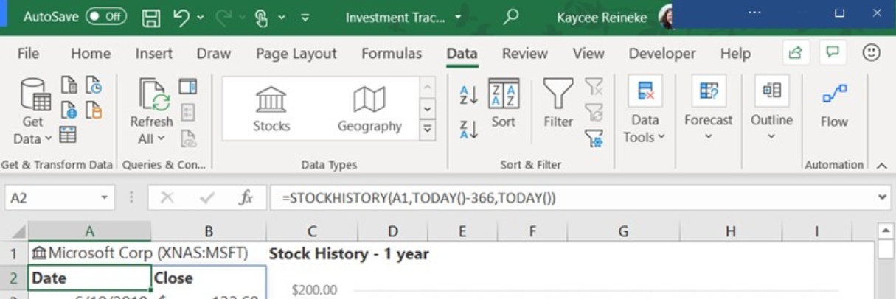
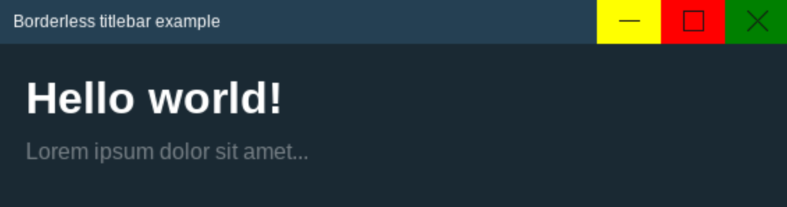
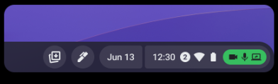
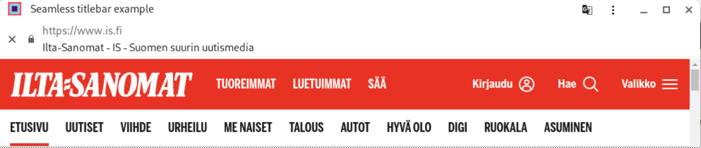

# Borderless Explainer

**Status**: draft, **Last updated**: 03.05.2023

Related documents:

- [window-controls-overlay explainer](https://github.com/WICG/window-controls-overlay/blob/main/explainer.md)
- [additional-windowing-controls explainer](https://github.com/ivansandrk/additional-windowing-controls/blob/main/awc-explainer.md)
- [ChromeOS app-details](crbug.com/1225871) (Googlers-only)
- [go/cros-privacy-indicators-design](go/cros-privacy-indicators-design)
  (Googlers-only)

## Table of contents

- [Borderless Explainer](#borderless-explainer)
  - [Table of contents](#table-of-contents)
  - [Introduction](#introduction)
  - [Example of a remote-app in VDI context with window-controls-overlay](#example-of-a-remote-app-in-vdi-context-with-window-controls-overlay)
  - [Goals](#goals)
  - [Non-goals](#non-goals)
  - [Proposal](#proposal)
    - [1. Setting the `display_override` to borderless](#1-setting-the-display_override-to-borderless)
    - [2. Enabling draggable regions](#2-enabling-draggable-regions)
    - [3. CSS display-mode media query for borderless](#3-css-display-mode-media-query-for-borderless)
    - [4. Leveraging Window Management permission for borderless](#4-leveraging-window-management-permission-for-borderless)
      - [Enabling Window Management](#enabling-window-management)
      - [Disabling Window Management](#disabling-window-management)
    - [5. Isolated Web App check](#5-isolated-web-app-check)
    - [Displaying app’s origin](#displaying-apps-origin)
    - [Privacy indicators](#privacy-indicators)
  - [Other notable details](#other-notable-details)
    - [“Settings and more” three-dot button](#settings-and-more-three-dot-button)
  - [Demo](#demo)
    - [manifest.json](#manifestjson)
    - [index.html](#indexhtml)
    - [style.css](#stylecss)
  - [Considered Alternatives](#considered-alternatives)
    - [Having a separate permission for borderless](#having-a-separate-permission-for-borderless)
    - [WCO extension](#wco-extension)
      - [Reasonings for discarding](#reasonings-for-discarding)
    - [New JS APIs](#new-js-apis)
      - [Reasonings for discarding](#reasonings-for-discarding-1)
  - [Security Considerations](#security-considerations)
    - [Spoofing risks](#spoofing-risks)
    - [Out-of-scope Navigation](#out-of-scope-navigation)
    - [Opening a popup from a borderless PWA](#opening-a-popup-from-a-borderless-pwa)
    - [Iframes](#iframes)

## Introduction

Currently all the possible app display and
[display_override](https://developer.mozilla.org/en-US/docs/Web/Manifest/display_override#values)
modes rely on apps having at least some format of a title bar - something
between the full Chrome title bar and currently most minimized
[`window-controls-overlay`](https://developer.mozilla.org/en-US/docs/Web/API/Window_Controls_Overlay_API) (WCO).
Despite WCO having some same qualities to what we are trying to achieve, it is
still not offering enough flexibility for some use-cases.

Some example use-cases for borderless (with no host-native title bar) could be:

1. Apps that want to fully customize their title bar to still have the same
   functionality, but with their own style, like
   [Steam](https://store.steampowered.com/).
2. Apps that want to completely remove the title bar and provide no controls 
   (which can be seen sometimes in native apps for dialogs like splash screens).
3. [VDI](https://www.softwaretestinghelp.com/best-vdi-software/#What_Is_Virtual_Desktop_Infrastructure)
   (Virtual Desktop Infrastructure) providers that want to mirror a remote app
   drawing a remote-OS-native title bar and we want to avoid drawing a second
   host-native title bar over the top of it or above it.

To enable such use-cases, this explainer will explain how the title bar will be
completely removed and so-called borderless mode enabled. This way the title bar
area is replaced with web content and so giving the developers full control on
how the title bar would look like.

## Example of a remote-app in VDI context with window-controls-overlay

When app is streamed through VDI, an enforced `window-controls-overlay` title
bar could still look clumsy. This is because it's a remote title bar that we
have no control over.



## Goals

- Enable full control over the appearance of the title bar area
- Ensure draggable regions work with borderless mode

## Non-goals

- Implementation of
  [additional windowing controls](https://github.com/ivansandrk/additional-windowing-controls/blob/main/awc-explainer.md),
  which is another closely-related project
- Making borderless mode dynamic (with e.g. JavaScript APIs or something else)
- Changing display mode in app settings (e.g. from borderless to standalone)
- Support for mobileOSs as there would be very little distinction from full-screen mode
- Support for non-IWAs (Isolated Web Apps)

## Proposal

The solution proposed consists of the following parts:

1. A new `display_override` option `borderless` for the web app manifest.
2. Enabling draggable regions when in borderless mode.
3. CSS display-mode media query for borderless.
4. Leveraging Window Management API permission (_earlier “Multi-screen Windows
   Placement” API permission_) for borderless mode.
5. Check that the app is Isolated Web App.

### 1. Setting the `display_override` to borderless

To provide the maximum addressable area for web content, the User Agent (UA)
will create a frameless window removing all UA provided by the browser, leaving
only resizing of the window from its borders. The removed window controls will
be enabled using AWC and HTML/JavaScript/CSS (see non-goals and
[additional-windowing-controls explainer](<[http://go/additional-windowing-controls](https://github.com/ivansandrk/additional-windowing-controls/blob/main/awc-explainer.md)>)).

Example apps in borderless mode could look e.g. like below but the appearance
would eventually fully depend on what the developer would implement.



The desire to remove the title bar will be declared within the web app manifest
by setting the `display_override` to `borderless`. The `display_override` value
will be ignored on unsupported OSs and it will act as a `standalone` window.
This is because Isolated Web Apps default are not supported to open in `browser` 
display mode.

```
{
  "display_override": [ "borderless" ]
}
```

### 2. Enabling draggable regions

When the app enters the borderless mode, app-defined 
[draggable regions](https://github.com/WICG/window-controls-overlay/blob/main/explainer.md#defining-draggable-regions-in-web-content)
will be enabled. Currently on many browsers, this is activated on elements with
`-webkit-app-region: drag;` there is an ongoing
[standards effort](https://github.com/w3c/csswg-drafts/issues/7017) to rename
this to `app-region`.

### 3. CSS display-mode media query for borderless

Similarly to other display modes, borderless should be queryable with @media.

Example media query with borderless:

```
@media (display-mode: borderless) {
  .any-css-class-name {
    margin: 5px;
  }
}
```

See [documentation of @media/display-mode](https://developer.mozilla.org/en-US/docs/Web/CSS/@media/display-mode).

### 4. Leveraging Window Management permission for borderless

In order for the borderless mode to activate, the app needs to have Window
Management permission granted. The permission prompt can be triggered using
JavaScript.

For the **managed** context, permission prompts can be by-passed with a policy
set by an admin and later on edited in the app’s settings. For the **unmanaged**
context, the Window management API permission must be granted.

In case the Window management permission is not provided, the app will act like
a `standalone` app as Isolated Web Apps do not support being opened in `browser`
mode.

#### Enabling Window Management

Granting the window management API permission can be done with the following
JavaScript:

```
const screenDetails = await window.getScreenDetails();
```

That will show the permission prompt to enable Window Management API permission
which will also enable borderless capability in case the permission is given.

Later on, the state of the permission can be queried with the following script:

```
navigator.permissions.query({name:'window-placement'})
  .then((status) => {
    // Do what you need with the permission state.
    console.log(status.state)
  });
```

If the user fails to grant the permission (e.g. clicks Block by accident), they
can also enable the permission from the app's settings.

#### Disabling Window Management

To disable borderless mode, the user can disable the Window Management
permission from the app's settings.

### 5. Isolated Web App check

Borderless mode is only available for
[Isolated Web Apps (IWAs)](https://github.com/WICG/isolated-web-apps).

### Displaying app’s origin

Since without the title bar and the 3-dot menu, the app’s origin won’t be visible
anymore, it should be shown somewhere else depending on each OS. E.g. for
ChromeOS it is intended to be displayed in App Settings.

Displaying the origin is a security requirement for web apps. However Isolated
Web Apps are shifting away from origins and towards app names. One way to still
be able to see the apps origin is via the developer console with
[`document.location.href`](https://developer.mozilla.org/en-US/docs/Web/API/Location/href).

### Privacy indicators

On some OSs removing the title bar might also remove the area for some critical
privacy indicators, e.g. for camera and microphone access. This is again
OS-dependant on where those indicators should be shown instead. One option is to
move them to the shelf.

Example on ChromeOS:


## Other notable details

### “Settings and more” three-dot button

Some implementations of PWAs, e.g. Chrome and Edge, show a three-dot menu
button. This gives users access to capabilities like for example extensions,
copy URL, open in browser, zoom, print, find, cast, cut, copy, paste etc
depending on the browser.

User agents in borderless mode will want to find some other place to put these,
or developers need to understand that they won't have all those options. Note
that other platforms (like Android) have already solved this by moving some of
the settings into the OS notifications tray, so this is not unprecedented. Also
many of them are still available using keyboard shorcuts.

Another way to get the three-dots menu working would be that it could be part of
the AWC feature, but that discussion should rather be part of the AWC feature.
This could also be something considered to implement later on if seen necessary.

## Demo

Demo app:
[https://github.com/sonkkeli/borderless/blob/main/webpack.swbn](webpack.swbn)

Demo app’s full code:
[https://github.com/sonkkeli/borderless/demo-app/](https://github.com/sonkkeli/borderless/demo-app/)

The implementation details presented here are the ones considered most important
to be able to create **a simple MVP using borderless mode**. There can be more
details and functionality in the demo app. Also the details for creating
Isolated Web Apps are still under development and keep changing so one should
find the IWA related implementation details from IWA related documents.

### manifest.json

```
{
  "name": "Borderless title bar example",
  "display_override": ["borderless"]
}
```

### index.html

```
<html>
  <head>
    <title>Borderless title bar example</title>
    <link rel="stylesheet" href="/style.css" />
    <link rel="manifest" href="/manifest.json">
    <script>
      if ('serviceWorker' in navigator) {
        navigator.serviceWorker.register('service-worker.js');
      };
    </script>
  </head>

  <body>
    <header id="titlebar">
      <div id="drag-region"></div>
    </header>
    <div id="main">
      <h1>Hello world!</h1>
    </div>
  </body>
</html>
```

### style.css

The draggable region for the (web content) title bar is set using
`-webkit-app-region: drag;`.

```
@media (display-mode: borderless) {
  body {
    background: blue;
  }
}

#titlebar {
  display: block;
  position: fixed;
  background: #254053;
  color: #FFFFFF;

  left: 0;
  top: 0;
  width: 100%;
  height: 33px;
  touch-action: none;
}

#titlebar #drag-region {
  width: 100%;
  height: 100%;
  -webkit-app-region: drag;
}

#main {
  margin-top: 33px;
  padding: 20px;
}
```

## Considered Alternatives

### Having a separate permission for borderless

In order to be able to close the borderless mode, one needs to have the AWC
permission. Then again AWC on its own knows nothing about multiple screens, so
you will not be able to move a window on another screen. If there are multiple
windows on multiple screens, one needs to allow cross-screen movement,
otherwise, the user experience is strange. So AWC needs to know about other
screens and their resolution. In the end, it seems like AWC would be able to
create a new window on any screen with arbitrary size and/or move an existing
window there. This is possible with the
[multi-screen window placement (MSWP)](https://github.com/w3c/window-placement/blob/main/EXPLAINER.md)
(after renaming Window Management) permission.

If all (borderless & AWC) would be separate permissions, their management in
SiteSettings would be extremely complicated and bug--prone, because only
enabling some of them might lead to a broken user experience. Also one would
need to explain to the users that they cannot disable some of them and keep the
others.

### WCO extension

Extending WCO by using the existing WCO toggle to enter borderless mode and
something new to exit.

Suggestions for exiting:

1. Right click on the app’s icon → “Show title bar” option there
2. Hover over the side/top of the app and show settings menu: When moving the
   mouse to the very far right or top of the screen, some settings bar would
   open up and one would be able to disable the borderless mode.
3. Holding down ESC → App permissions / settings
4. Message on re-focus of an app

#### Reasonings for discarding

In general exiting differently from entering would be fairly inconsistent and
wouldn’t reutilize the existing capabilities much more than the chosen solution.
The chosen approach was the one preferred by the security & privacy team members
regarding those security aspects combined with the amount of engineering work
required.

### New JS APIs

Entering and existing borderless mode using JS APIs. On top of the manifest’s
display_override `borderless` value and user permission, these APIs would enable
manual toggling of the borderless mode. Calling the APIs in JS could look
something like this: `window.requestBorderless()` and `window.exitBorderless()`

#### Reasonings for discarding

This could still be considered as an extension on top of the currently planned
solution if such features would be considered as useful. Currently there’s no
use-case for needing these.

## Security Considerations

### Spoofing risks

Giving sites partial control of the title bar leaves room for developers to
spoof content in what was previously a trusted, UA-controlled region. To
mitigate the threat of spoofing, the feature is (at least for now) only targeted
to be available for Isolated Web Apps and users will have to opt-in to the
feature via a window management permission prompt or via admins’ policies. The
title bar can be returned via App settings by toggling off the borderless mode
capability.

### Out-of-scope Navigation

An existing security feature for installed web apps is an indicator of when a
user has left the declared scope of the app. When a user navigates out of scope,
a black bar appears between the title bar and the web content, and it includes
the following information:

- A close button to allow users to easily navigate back into scope
- A security icon which opens the security info popup when clicked
- The origin and title of the site
- In borderless mode, if a user navigates out-of-scope the web app will revert
  to standalone display mode (with a standalone title bar). When the user
  navigates back into scope, the standalone title bar will be removed again and
  the borderless mode enabled.

Example of when out-of-scope, so reverting to the standalone title bar with
custom tab bar stating the current origin:



### Opening a popup from a borderless PWA

- Opening a popup to any other origin → The popup should NOT be in borderless
  mode (security risk if the following pop-up app would be malicious).
- Opening a popup to itself (same origin) → The popup opens in borderless mode,
  because the app has already got the permission to run in borderless mode.

### Iframes

- Display modes cannot be enabled on embedded pages.
