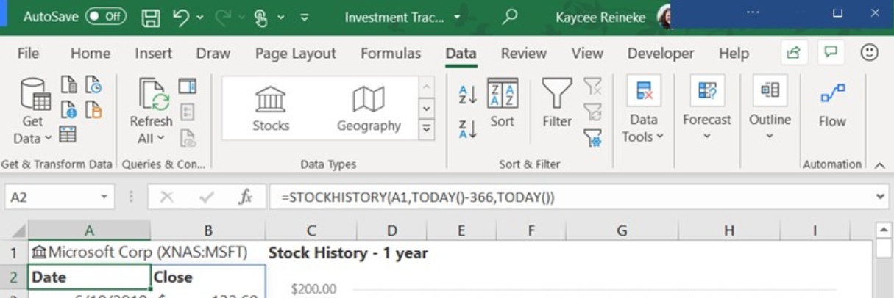
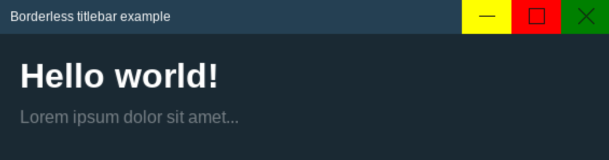
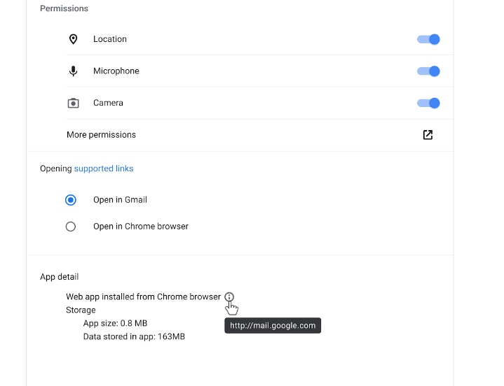
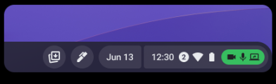
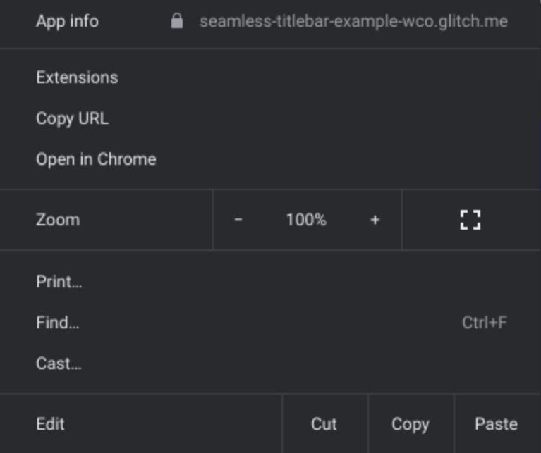
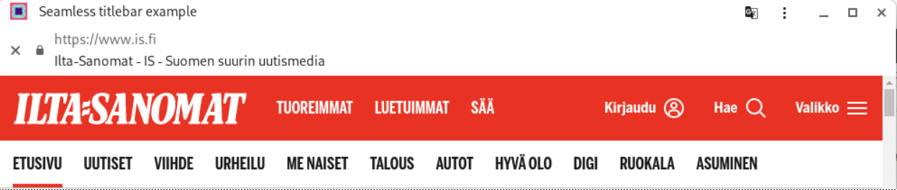

# Borderless Explainer

**Status**: draft, **Last updated**: 03.05.2023

Related documents:

- [window-controls-overlay explainer](https://github.com/WICG/window-controls-overlay/blob/main/explainer.md)
- [additional-windowing-controls explainer](https://github.com/ivansandrk/additional-windowing-controls/blob/main/awc-explainer.md)
- [ChromeOS app-details](crbug.com/1225871) (Googlers-only)
- [go/cros-privacy-indicators-design](go/cros-privacy-indicators-design)
  (Googlers-only)

## Table of contents

- [Borderless Explainer](#borderless-explainer)
  - [Table of contents](#table-of-contents)
  - [Introduction](#introduction)
  - [Example of a complex title bar with window-controls-overlay](#example-of-a-complex-title-bar-with-window-controls-overlay)
  - [Goals](#goals)
  - [Non-goals](#non-goals)
  - [Proposal](#proposal)
    - [1. Setting the `display_override` to borderless](#1-setting-the-display_override-to-borderless)
    - [2. Enabling draggable regions](#2-enabling-draggable-regions)
    - [3. CSS display-mode media query for borderless](#3-css-display-mode-media-query-for-borderless)
    - [4. Leveraging Window Management permission for borderless](#4-leveraging-window-management-permission-for-borderless)
      - [Enabling Window Management](#enabling-window-management)
      - [Disabling Window Management](#disabling-window-management)
    - [5. Isolated Web App check](#5-isolated-web-app-check)
  - [Related features](#related-features)
    - [Displaying app’s origin in the app settings UI](#displaying-apps-origin-in-the-app-settings-ui)
    - [Privacy indicators](#privacy-indicators)
  - [Other notable details](#other-notable-details)
    - [“Settings and more” three-dot button](#settings-and-more-three-dot-button)
  - [Demo](#demo)
    - [manifest.json](#manifestjson)
    - [index.html](#indexhtml)
    - [style.css](#stylecss)
  - [Considered Alternatives](#considered-alternatives)
    - [Having a separate permission for borderless](#having-a-separate-permission-for-borderless)
    - [WCO extension](#wco-extension)
      - [Reasonings for discarding](#reasonings-for-discarding)
    - [New JS APIs](#new-js-apis)
      - [Reasonings for discarding](#reasonings-for-discarding-1)
  - [Security Considerations](#security-considerations)
    - [Spoofing risks](#spoofing-risks)
    - [Out-of-scope Navigation](#out-of-scope-navigation)
    - [Opening a popup from a borderless PWA](#opening-a-popup-from-a-borderless-pwa)
    - [Iframes](#iframes)

## Introduction

[VDI](https://www.softwaretestinghelp.com/best-vdi-software/#What_Is_Virtual_Desktop_Infrastructure)
(Virtual Desktop Infrastructure) providers attempt to mirror remote applications
to the local desktop. For example, the VDI provider's cloud is running a Text
Processor (a desktop application window), which is to be presented on the client
desktop as if the application was running locally.

Installed web apps define their display mode in the manifest.json using display
and
[display_override](https://github.com/WICG/display-override/blob/main/explainer.md)
fields. Currently
[supported values for display modes](<https://source.chromium.org/chromium/chromium/src/+/main:third_party/blink/public/mojom/manifest/display_mode.mojom?q=-file:(test%7CDebug%7C%5C.xtb$)%20case:yes%20third_party%2Fblink%2Fpublic%2Fmojom%2Fmanifest%2Fdisplay_mode.mojom&ss=chromium>)
are `window-controls-overlay`, `tabbed`, `minimal-ui`, `standalone`, `browser`
and `fullscreen`. See
[Manifest/display_override#values](https://developer.mozilla.org/en-US/docs/Web/Manifest/display_override#values)
for more. From the before-mentioned options, `window-controls-overlay` has some
same qualities to what we are trying to achieve. However, it is still not
offering enough native-like experience for some of the use-cases and thus this
explainer will explain how the title bar will be totally removed and enabling
so-called borderless mode where the title bar area would be replaced with web
content and so giving the developers full control on how the title bar would
look like.

## Example of a complex title bar with window-controls-overlay

Some highly customized title bars would still look clumsy with
`window-controls-overlay` enforcing the style of the windowing controls
(minimize, maximize, close etc.).



## Goals

- Enable full control over the appearance of the title bar area
- Ensure draggable regions work with borderless mode

## Non-goals

- Implementation of
  [additional windowing controls](https://github.com/ivansandrk/additional-windowing-controls/blob/main/awc-explainer.md),
  which is another closely-related project
- Making borderless mode dynamic (with e.g. JavaScript APIs or something else)
- Changing display mode in app settings (e.g. from borderless to standalone)
- Support for mobileOSs/macOS/windows
- Support for non-IWAs (Isolated Web Apps)

## Proposal

The solution proposed consists of the following parts:

1. A new `display_override` option `borderless` for the web app manifest.
2. Enabling draggable regions when in borderless mode.
3. CSS display-mode media query for borderless.
4. Leveraging Window Management API permission (_earlier “Multi-screen Windows
   Placement” API permission_) for borderless mode.
5. Check that the app is Isolated Web App.

### 1. Setting the `display_override` to borderless

To provide the maximum addressable area for web content, the User Agent (UA)
will create a frameless window removing all UA provided Chrome, leaving only
resizing of the window from its borders. The removed window controls will be
enabled using AWC and HTML/JavaScript/CSS (see non-goals and
[additional-windowing-controls explainer](<[http://go/additional-windowing-controls](https://github.com/ivansandrk/additional-windowing-controls/blob/main/awc-explainer.md)>)).
Additionally to hiding the native title bar, also the menu button is hidden.

Example apps in borderless mode could look e.g. like below but the appearance
would eventually fully depend on what the developer would implement.



The desire to remove the title bar will be declared within the web app manifest
by setting the `display_override` to `borderless`. The display_override value
will be ignored on unsupported OSs and they will follow the normal display mode
hierarchy.

```
{
  "display_override": [ "borderless" ]
}
```

### 2. Enabling draggable regions

When the app enters the borderless mode,
[draggable regions](https://github.com/WICG/window-controls-overlay/blob/main/explainer.md#defining-draggable-regions-in-web-content)
`-webkit-app-region: drag;` will be enabled.

### 3. CSS display-mode media query for borderless

Similarly to other display modes, borderless should be queryable with @media.

Example media query with borderless:

```
@media (display-mode: borderless) {
  .any-css-class-name {
    margin: 5px;
  }
}
```

See:
[https://developer.mozilla.org/en-US/docs/Web/CSS/@media/display-mode](https://developer.mozilla.org/en-US/docs/Web/CSS/@media/display-mode)

### 4. Leveraging Window Management permission for borderless

In order for the borderless mode to activate, the app needs to have Window
Management permission granted. The permission prompt can be triggered using
JavaScript.

For the **managed** context, permission prompts can be by-passed with a policy
set by an admin and later on edited in the app’s settings. For the **unmanaged**
context, the Window management API permission must be granted.

#### Enabling Window Management

Granting the window management API permission can be done with the following
JavaScript:

```
const screenDetails = await window.getScreenDetails();
```

That will show the permission prompt to enable Window Management API permission
which will also enable borderless capability in case the permission is given.

Later on, the state of the permission can be queried with the following script:

```
navigator.permissions.query({name:'window-placement'})
  .then((status) => {
    // Do what you need with the permission state.
    console.log(status.state)
  });
```

#### Disabling Window Management

To disable borderless mode, the user can disable the Window Management
permission in App Settings.

In case the Window management permission is not provided or no longer in place,
the app will follow the normal display mode hierarchy based on the
`display_override` and display values on the `manifest.json`. In case no other
display mode is provided, it will
[default to standalone mode](https://source.chromium.org/chromium/chromium/src/+/main:chrome/browser/web_applications/web_app_proto_utils.cc;drc=4a8573cb240df29b0e4d9820303538fb28e31d84;l=161)
similarly to WCO and other `display_override` modes.

### 5. Isolated Web App check

Borderless mode is only available for
[Isolated Web Apps (IWAs)](https://github.com/WICG/isolated-web-apps).

## Related features

- [app-details feature](crbug.com/1225871) (Googlers-only)
- [go/cros-privacy-indicators-design](go/cros-privacy-indicators-design)
  (Googlers-only)
- [additional windowing controls](https://github.com/ivansandrk/additional-windowing-controls/blob/main/awc-explainer.md)

### Displaying app’s origin in the app settings UI

Since without the title bar and the 3-dot menu, the app’s origin won’t be visible
anymore, it needs to be shown somewhere, in this case in App Settings. This
work has been completed as part of the [app-details feature](crbug.com/1225871),
but it is pending its launch.

Displaying the origin is mainly necessary for debugging purposes. Until the app
details get launched, an alternative way to get the origin of an IWA in
borderless mode is via the developer console with
[`document.location.href`](https://developer.mozilla.org/en-US/docs/Web/API/Location/href).

In the future when app details have been launched and origin is available, the
app settings can be accessed via opening the system’s settings and then looking
for the right app or by right clicking the app’s icon on the shelf. Or by
visiting the app's OS-settings in the following type of URL:
<span style="text-decoration:underline;">chrome://os-settings/app-management/detail?id=&lt;APP_ID></span>

Mock of app settings UI with app’s origin:  


### Privacy indicators

Removing the title bar also removes the area where critical privacy indicators
would live, e.g. for camera and microphone access. However there is already
another on-going project to move those privacy indicators to the shelf.



See (Googlers only)
[go/cros-privacy-indicators-design](go/cros-privacy-indicators-design) for more.

## Other notable details

### “Settings and more” three-dot button

Since the three-dot button (which gives users access to extensions, security
information about the page, access to cookies, etc.) will be disappearing, the
most critical information (app’s origin) will be displayed in the app settings.

The menu behind the three-dots button contains the following:



<table>
  <tr>
   <td><strong>Button</strong></td>
   <td><strong>Status</strong></td>
  </tr>
  <tr>
   <td>App info</td>
   <td>
    <ul>
      <li>App’s origin will be added to App settings.</li>
      <li>Cookies will be only accessible through developer console.</li>
      <li>Connection security will be only accessible through developer console.</li>
    </ul>
   </td>
  </tr>
  <tr>
   <td>Extensions</td>
   <td>Will not be supported in the first version. This is something that can be considered and implemented later if needed.
   </td>
  </tr>
  <tr>
   <td>Copy URL</td>
   <td>Will not be supported in the first version. This is something that can be considered and implemented later if needed.
   </td>
  </tr>
  <tr>
   <td>Open in Chrome</td>
   <td>Will not be supported in the first version. This is something that can be considered and implemented later if needed.
   </td>
  </tr>
  <tr>
   <td>Zoom</td>
   <td>Will still work using shortcuts (Ctrl++ & Ctrl+- & Ctrl+0).</td>
  </tr>
  <tr>
   <td>Print</td>
   <td>Will still work using shortcuts (Ctrl+P).</td>
  </tr>
  <tr>
   <td>Find</td>
   <td>Will still work using shortcuts (Ctrl+F).</td>
  </tr>
  <tr>
   <td>Cast</td>
   <td>Will not be supported in the first version. This is something that can be considered and implemented later if needed.
   </td>
  </tr>
  <tr>
   <td>Cut</td>
   <td>Will still work using shortcuts (Ctrl+X).</td>
  </tr>
  <tr>
   <td>Copy</td>
   <td>Will still work using shortcuts (Ctrl+C).</td>
  </tr>
  <tr>
   <td>Paste</td>
   <td>Will still work using shortcuts (Ctrl+V).</td>
  </tr>
</table>

A way to get the three-dots menu working would be that it could be part of the
AWC feature, but that discussion should rather be part of the AWC feature. This
could also be something considered to implement later on if seen necessary.

## Demo

Flags to enable:

- <span style="text-decoration:underline;">chrome://flags#enable-desktop-pwas-borderless</span> (Linux/ChromeOS only)
- <span style="text-decoration:underline;">chrome://flags#enable-isolated-web-apps</span>
- <span style="text-decoration:underline;">chrome://flags#enable-isolated-web-app-dev-mode</span>
- Path of your Isolated Web App file <span style="text-decoration:underline;">chrome://flags#install-isolated-web-app-from-file</span>

Demo app:
[https://github.com/sonkkeli/borderless/blob/main/webpack.swbn](webpack.swbn)

Demo app’s full code:
[https://github.com/sonkkeli/borderless/demo-app/](https://github.com/sonkkeli/borderless/demo-app/)

The implementation details presented here are the ones considered most important
to be able to create **a simple MVP using borderless mode**. There can be more
details and functionality in the demo app. Also the details for creating
Isolated Web Apps are still under development and keep changing so one should
find the IWA related implementation details from IWA related documents.

### manifest.json

```
{
  "name": "Borderless title bar example",
  "display": "standalone",
  "display_override": ["borderless"]
}
```

### index.html

```
<html>
  <head>
    <title>Borderless title bar example</title>
    <link rel="stylesheet" href="/style.css" />
    <link rel="manifest" href="/manifest.json">
    <script>
      if ('serviceWorker' in navigator) {
        navigator.serviceWorker.register('service-worker.js');
      };
    </script>
  </head>

  <body>
    <header id="titlebar">
      <div id="drag-region"></div>
    </header>
    <div id="main">
      <h1>Hello world!</h1>
    </div>
  </body>
</html>
```

### style.css

The draggable region for the (web content) title bar is set using
`-webkit-app-region: drag;`.

```
@media (display-mode: borderless) {
  body {
    background: blue;
  }
}

#titlebar {
  display: block;
  position: fixed;
  background: #254053;
  color: #FFFFFF;

  left: 0;
  top: 0;
  width: 100%;
  height: 33px;
  touch-action: none;
}

#titlebar #drag-region {
  width: 100%;
  height: 100%;
  -webkit-app-region: drag;
}

#main {
  margin-top: 33px;
  padding: 20px;
}
```

## Considered Alternatives

### Having a separate permission for borderless

In order to be able to close the borderless mode, one needs to have the AWC
permission. Then again AWC on its own knows nothing about multiple screens, so
you will not be able to move a window on another screen. If there are multiple
windows on multiple screens, one needs to allow cross-screen movement,
otherwise, the user experience is strange. So AWC needs to know about other
screens and their resolution. In the end, it seems like AWC would be able to
create a new window on any screen with arbitrary size and/or move an existing
window there. This is possible with the
[multi-screen window placement (MSWP)](https://github.com/w3c/window-placement/blob/main/EXPLAINER.md)
(after renaming Window Management) permission.

If all (borderless & AWC) would be separate permissions, their management in
SiteSettings would be extremely complicated and bug--prone, because only
enabling some of them might lead to a broken user experience. Also one would
need to explain to the users that they cannot disable some of them and keep the
others.

### WCO extension

Extending WCO by using the existing WCO toggle to enter borderless mode and
something new to exit.

Suggestions for exiting:

1. Right click on the app’s icon → “Show title bar” option there
2. Hover over the side/top of the app and show settings menu: When moving the
   mouse to the very far right or top of the screen, some settings bar would
   open up and one would be able to disable the borderless mode.
3. Holding down ESC → App permissions / settings
4. Message on re-focus of an app

#### Reasonings for discarding

In general exiting differently from entering would be fairly inconsistent and
wouldn’t reutilize the existing capabilities much more than the chosen solution.
The chosen approach was the one preferred by the security & privacy team members
regarding those security aspects combined with the amount of engineering work
required.

### New JS APIs

Entering and existing borderless mode using JS APIs. On top of the manifest’s
display_override “borderless” value and user permission, these APIs would enable
manual toggling of the borderless mode. Calling the APIs in JS could look
something like this: `window.requestBorderless()` and `window.exitBorderless()`

#### Reasonings for discarding

This could still be considered as an extension on top of the currently planned
solution if such features would be considered as useful. Currently there’s no
use-case for needing these.

## Security Considerations

### Spoofing risks

Giving sites partial control of the title bar leaves room for developers to
spoof content in what was previously a trusted, UA-controlled region. To
mitigate the threat of spoofing, the feature is (at least for now) only targeted
to be available for Isolated Web Apps and users will have to opt-in to the
feature via a window management permission prompt or via admins’ policies. The
title bar can be returned via App settings by toggling off the borderless mode
capability.

### Out-of-scope Navigation

An existing security feature for installed web apps is an indicator of when a
user has left the declared scope of the app. When a user navigates out of scope,
a black bar appears between the title bar and the web content, and it includes
the following information:

- A close button to allow users to easily navigate back into scope
- A security icon which opens the security info popup when clicked
- The origin and title of the site
- In borderless mode, if a user navigates out-of-scope the web app will revert
  to standalone display mode (with a standalone title bar). When the user
  navigates back into scope, the standalone title bar will be removed again and
  the borderless mode enabled.

Example of when out-of-scope, so reverting to the standalone title bar with
custom tab bar stating the current origin:



### Opening a popup from a borderless PWA

- Opening a popup to any other origin → The popup should NOT be in borderless
  mode (security risk if the following pop-up app would be malicious).
- Opening a popup to itself (same origin) → The popup opens in borderless mode,
  because the app has already got the permission to run in borderless mode.

### Iframes

- Borderless mode should not be available for iframes embedded inside of an IWA.
