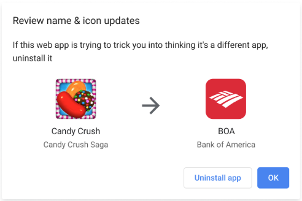
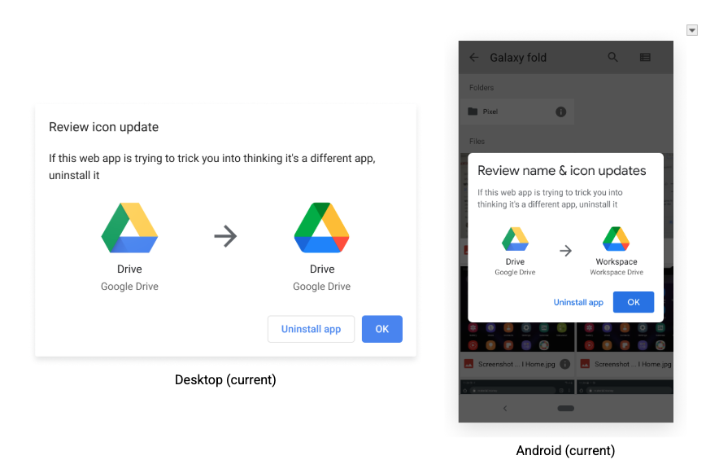
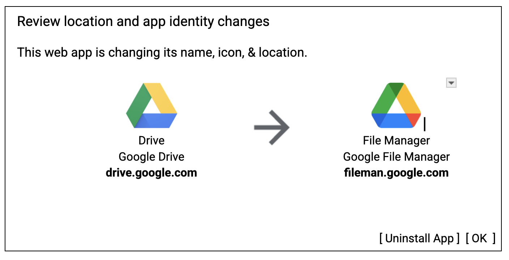

# Predictable Web App Updating \- Explainer

Author: Dibyajyoti Pal (dibyapal@chromium.org)

# **Introduction**

This explainer proposes a way to have PWAs fully update their identities in a safe and resourceful manner on Desktop and Android, to further bridge the gap between PWAs and native apps. This is done by updating the [manifest spec](https://www.w3.org/TR/appmanifest/#web-application-manifest) to have a specific field for making updates more deterministic by the developer, and for providing a consistent experience. The proposal attempts to do so in a way that:

1. Uses less resources, making network usage more efficient.  
2. Prevent user confusion by showing the update UX less often.

Currently, while the manifest update process is well defined, the detection of when an update should happen is not, leading to [problems](#chromium-problems). This proposal attempts to fix that.

# [**Chromium PWA update detection, and its problems**](#chromium-problems)

Currently, detecting that a PWA needs an update goes like this:

- On page load of an url within the [scope of an installed PWA](https://www.w3.org/TR/appmanifest/#scope-member), a manifest update is triggered.  
- The manifest, and the resources defined in it, are downloaded and compared with the installed PWA and its resources.  
- If there is a difference, an update happens.  
  - If the difference is in security sensitive fields, like the name, icon or short name, the user agent shows a UX notifying the user that an update is supposed to happen.  
  - The UX shows the differences between the old and the new sensitive fields, and asks the user to either accept the changes or uninstall the app.

## Problem: Update check wastes bandwidth, requiring a throttle

Network resources are wasted by performing icon downloads over and over again just to see if an update is needed. Chromium's current implementation is forced to mitigate this problem by introducing a [throttle](https://web.dev/articles/manifest-updates) to reduce wasted downloads for non-updates. 

This also causes confusion among developers testing manifest updates for their sites, as updates are throttled to once per day. This required addition of a new [flag](https://web.dev/articles/manifest-updates#cr-desktop-test) to bypass the throttle.

## Problem: Basic icon diff triggers an update dialog too often 

Sometimes, icons would change in use-cases that wouldn’t really require an intrusive UX dialog to be shown to the user. Some use-cases where that would happen are:

- Developers making minor changes to icons which would not be visibly noticeable.  
- CDNs dynamically re-encoding icons.

Both these would trigger manifest updates, with the end user seeing no “visible” difference in the update UX, and would be confused about why this was popping up and interrupting their workflow. This led the behavior to be treated as spammy.

Chrome on Android solved it with a stop gap where PWA updates were automatic if the visual difference between the downloaded icon and the local icon was less than 10%.

## Problem: Developers have no control over when the update dialog may show up

The dialog shows up whenever Chrome sees the new manifest & detects changes. Developers have to accept that every change to security sensitive members could trigger this. They cannot, for example, make a number of incremental changes, and then trigger one update dialog at the end once they are all done.

# **Goals**

The current manifest update process gets the job done, but it could be better in a way so that the problems above can be fixed:

* Provide a consistent way to detect when a manifest update should happen.  
* Users should not see an update dialog more than necessary to confirm security-sensitive changes.  
  * Tiny image data changes below a threshold should not trigger the update dialog in the algorithm, even if the image URL remains the same. 
* Developers should have more control over when the update dialog may show to users.  
* Unnecessary network traffic should be minimized.  
* Encourage developers to set the manifest 'id' field, preventing a known [foot-gun](https://github.com/w3c/manifest/issues/1148).

# **Proposal: Introduce 'update\_token', ignore icon changes by default**

The existence and non-existence of the `update_token` field will be used to trigger manifest updating logic, based on the following guidelines:

* `update_token` is parsed if-and-only-if an 'id' field is set.

```

{
  "name": "The Best App",
  "id": "app",
  "start_url": ".",
  "display": "standalone",
   ....
   "update_token": "foo1"
}

```

## Token based update detection

* If `seen_manifest.update_token` and is changed from the `saved_manifest.update_token,`then a manifest update is triggered.  
* If an `seen_manifest.update_token` is provided but is unchanged from the app’s `saved_manifest.update_token`, no update is triggered.  
  * This includes fields outside of `name, short_name` and `icons`, AKA fields that are not tied to the identity of the manifest and is thus not secure.

## Default (non-token-based) update detection

Without the presence of an `update_token` in the manifest, **ONLY** icon updates will be allowed if there are changes in the icon url specified in the manifest.

## Behavior

The below table introduces all possible combinations of behavior that can happen based on the status of the `update_token` field in `seen_manifest` or in `saved_manifest.`

| saved ↓ seen → | “foo” | unspecified |
| :---: | :---: | :---: |
| **“foo”** | Token based | Token based |
| **unspecified** | Token based | Non token based |

### Pre-requisites:

- An app corresponding to the manifest has already been installed.

# **How does this solve the problem?**

Looking at the goals above and tied it to the proposal:

> Provide a consistent way to detect when a manifest update should happen.

The presence of a different value of `update_token` compared to the one saved, and icon urls changing are the only 2 use-cases where a manifest update can happen.

> Users should not see an update dialog more than necessary to confirm security-sensitive changes.
> Developers should have more control over when the update dialog may show to users.


The users should only see the dialog when the developer wants them to. To do so, the developer has to do either of the 2 things specified (AKA change the  `update_token` value or change the icon urls).

> Unnecessary network traffic should be minimized.

The most network heavy traffic is downloading icons, which will only happen when the developer wants them to, and not randomly.

# **Alternatives considered**

## Allow end users to ignore updates

End users can turn off “updates” for their installed app from the settings page of their app.

Cons: 

- Users don’t get new functionalities specified by the developer, like `file_handlers`.  
- Developer complexity is too high to “support” old versions of the same PWAs, leading to incompatible feature sets across different “versions” of the manifest used by users.  
- User agents would have to build a custom UI and logic trigger updates when the user is ready, or to save that a user has ignored one. Otherwise the only solution for the end user would be to uninstall and then reinstall.  
- Old application configurations are often connected with security vulnerabilities.

## Only update on manifest\_url change

While this solution is simple to implement, it breaks existing update behavior, and is also cumbersome for developers, who would have to update where they serve their manifest from every time a change is made.

# **Accessibility, Privacy, and Security Considerations** 

## Abuse Scenarios

### Phishing

A malicious site could add icons and names to its manifest so that it comes across as a non-malicious PWA (like a calculator app). On installation, the site can update the icon, name and short name fields to mimic that of a (bank app) behind the scenes, and end users are tricked into entering their information into a malicious site.

See example below of how this could happen:  


**Mitigation:** The presence of a UX showing the end user the difference in the icons mitigates this risk.

Also, with the icon update threshold of 10%, the developer will have to make the user visit the site multiple times to trigger silent updates, and make tiny incremental changes to take advantage of the background icon algorithm in order to evade detection. That makes this abuse scenario highly unlikely for the user.

## UX

The current UX dialog being shown to users on Chrome when a security sensitive update happens looks like the following:



There are a few problems with this UX:

- The wording is a bit strong, and comes across as if PWAs are “tricky”.  
- The wording around the options to either accept the new manifest fields or uninstall the app could be made more mellow.

**Solution:** The wording can be made more mellower since manifest updates are now being moved to becoming the developer’s intention.

Proposed UX is something like the following (still under investigation):  


## **Future Considerations**

### Allow developers to use javascript to trigger a pending update

This proposal allows developers to control when an update happens in general for users of an old version, but not at a specific time in the user experience of their site. In the future a javascript API could be used similar to the `beforeinstallprompt` API, allowing the developer to put UX on their site to trigger the update dialog.

# **Notes**

- Since [any website is an installable application](https://www.w3.org/TR/appmanifest/#installable-web-applications), if a user agent allows installation of a site that never specified an explicit manifest, update can still occur if the manifest ids matches.  
- The user agent can perform the following tasks if they want:  
  - Notify the end user that the app has been updated, like native apps do.  
  - Provide a warning string in the console for developers if they change icons but forget to add/update the `update_token`.