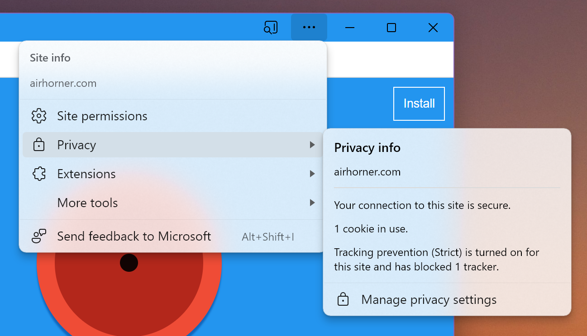

# Scope Extensions for Web App Manifest

## Participate

* [Github issues](https://github.com/WICG/manifest-incubations/issues?q=is%3Aissue+is%3Aopen+label%3Ascope-extensions)

## Introduction

This explainer proposes a new `scope_extensions` [Web Application
Manifest](https://www.w3.org/TR/appmanifest/) member that extends the concept of
[app scope](https://www.w3.org/TR/appmanifest/#understanding-scope). 

The scope of an installed web app "restricts the URLs to which the manifest is
applied and provides a means to 'deep link' into a web application from other
applications." User agents apply metadata in the manifest to documents [within
scope](https://www.w3.org/TR/appmanifest/#dfn-within-scope) and often apply
differential UX treatments to make it obvious when an app window navigates to
documents outside of scope.

Currently, the scope of an app can only include URLs from a single [web
origin](https://datatracker.ietf.org/doc/rfc6454/). Web developers who are
interested in creating a web app with contents located in multiple different web
origins find themselves unable to do so. This leads to a poor user experience
when viewing documents that are part of the app but are technically
out-of-scope. Users may be confused by browser UI marking the page as
out-of-scope, and some desired app-like features such as deep linking may not
function at all for out-of-scope documents.

Apps that wish to define a scope spanning multiple different origins could do so
using the `scope_extensions` manifest field detailed below.

## What apps could benefit?

For each example below, developers have expressed interest in publishing a
single installable app instead of one per origin with distinct app identities. 

### TLD locales

An app can have content from multiple Top Level Domains representing different
locales. Each site is usually structured identically but could have differences
in policies, displayed language, etc. Example:
* https://www.starbucks.fr, https://www.starbucks.de, https://www.starbucks.ca, ... 

### Shortened/Vanity URLs

An app can share shortened/vanity URLs and want those URLs to be captured to app
windows when navigated. Example:
* https://youtu.be/dQw4w9WgXcQ is the shortened URL for
  https://www.youtube.com/watch?v=dQw4w9WgXcQ. 

### Sub-domain locales

An app can also use different sub-domains to represent different locales.
Example:
* https://en.wikipedia.org, https://fr.wikipedia.org, ...

### Sub-domains that represent different user groups (non-goal)
Some sites are structured to use sub-domains to represent different groups or
organizations but may want to publish a single installable app instead of one
for each. Examples:
* https://chromium.slack.org, https://foo.slack.org, https://bar.slack.org
* https://foo.zoom.us, https://bar.zoom.us, ...

Addressing this case is considered a non-goal for this explainer because it is
not possible to enumerate and validate all of the matching sub-domains at
install time. This work is left to a future explainer.

## Key User Scenarios

### Out-of-scope UX

In Chromium browsers, top-level app window navigation to an out-of-scope URL
creates a notification bar - this notification bar informs the user that they
have navigated outside of app scope or to a different origin altogether and
provides a control to return to the `start_url`. This UI bar protects the user
by providing useful information about the change in browsing context. It is not
dismissable without navigating the page back to the `start_url`. Other browser
implementations may include similar behavior.

<figure>
    
    <figcaption>Example: installed web app window with out-of-scope UI bar</figcaption>
</figure>

The app window shown above has navigated to a url (`https://airhorner.com`)
outside of its scope (`https://diek.us/pwinter/`). The white bar above the web
contents informs the user of this difference. This feature is important as it
aims to keep the user aware of the content's security context.

A developer may intentionally want to include documents from different origins
in app scope. In this case, an obtrusive out-of-scope bar is not necessary and
could confuse users. 

### Out-of-scope navigations leave the app window

When a page in an app window navigates to an out-of-scope URL, some browser
implementations may handle it by opening a new tab or browsing context in a
regular browser window. This can appear jarring for users if they are unfamiliar
with how scope works and the content appears to still be part of the app.
Developers can use `scope_extensions` to ensure appropriate navigations do not
leave the app window. 

### Navigation Capture (a.k.a. In-browser Link Capture)

Navigation capturing is a behavior that captures suitable browser window page
navigations and opening them an app window when the target URL matches the scope
of an installed app. This behavior is common on mobile platforms and is [in
development](https://issues.chromium.org/issues/40058251) for desktop platforms
in Chromium. Navigation capturing relies on the scope of an app to decide if a
navigation is entering or leaving an app. Developers can use `scope_extensions`
to ensure appropriate browser navigations open in an app window. 

Navigation capturing can be combined with
[`launch_handlers`](https://developer.mozilla.org/en-US/docs/Web/Manifest/launch_handler)
to create a tailored app navigation experience.  

### Other manifest features
As app scope is used as the boundary for the application of manifest metadata
such as
[`theme_color`](https://developer.mozilla.org/en-US/docs/Web/Manifest/theme_color),
documents intended to be part of the app but are excluded from app scope cannot
take part and are not presented in a consistent manner. [Window Controls
Overlay](https://developer.mozilla.org/en-US/docs/Web/API/Window_Controls_Overlay_API)
is another example - the overlay is not applied to the titlebar when the main
document in the app window is out-of-scope. 

## Goals

- Allow developers to define an app scope using a list of origins known at
  install time.

- Allow developers to specify a scoping path for each listed origin similar to
  how the manifest `scope` field works.

- Allow web apps to capture user navigations to sites they are affiliated with.
  E.g. "News Aggregator App" capturing links navigations to examplenewssite.com.

## Non-goals

- Allow developers to define an app scope that includes an unknown number of
  origins at install time, such as could be done using URL pattern matching or
  by including all origins of an entire site. 

- Allow developers to define scope in a single origin using more complicated URL
  filters, lists of filters, etc.

- Allow developers to exclude URLs from app scope.

## Proposed solution

To extend app scope, a developer will:

1. Add a `scope_extensions` section to the web app manifest which lists one or
  more extensions. 

1. Host a `.well-known/web-app-origin-association` file at each additional
  origin. This file establishes a two-way handshake between a unique app and the
  origin owner. It also contains any fine-grain URL filters needed to control
  scope.

### Manifest

Example manifest located at `https://example.com/manifest.webmanifest`:
   ```json
   {
     "id": "https://example.com/app",
     "name": "My App",
     "display": "standalone",
     "start_url": "/app/index.html",
     "scope": "/app",
     "scope_extensions": [
       { "type": "origin", "value": "https://example.co.uk" },
       { "type": "origin", "value": "https://help.example.com" }
     ]
   }
   ```
The "Example" app has a regular scope of `http://example.com/app` and is
extending its app scope to the origins `https://example.co.uk` and
`https://help.example.com`.

* Each entry in `scope_extensions` must contain both `type` and `value` string
fields.
* `type` must be `"origin"`. Other types could be added in the future.
* `value` must a valid URL. The URL is converted to an
  [origin](https://html.spec.whatwg.org/multipage/browsers.html#concept-origin-tuple). 

### Association file

A `web-app-origin-association` file must be served from
`https://<associatedorigin>/.well-known/web-app-origin-association`. An app is
allowed to extend its scope to this origin if their manifest ID is found in this
file.

Example association file located at
   `https://example.co.uk/.well-known/web-app-origin-association`:

```json
{
  "https://example.com/app": {
    "scope": "/app"   // Evaluates to https://example.co.uk/app
  }
}
```

* Each dictionary key must be a validly formatted [web application
id](https://w3c.github.io/manifest/#id-member).
* Each dictionary value must be an object.
* Each dictionary value can optionally contain a `scope` string. If not
  provided, `scope` defaults to `/`.
* This `scope` configures the extension scope each identified app is allowed to
  utilize.
* This `scope` works the same way as `scope` in the manifest and is relative to
this origin. 

## Security Considerations

### Link capturing from another origin

If an origin A adds a web app B to its `web-app-origin-association` file, A is
implicitly authorizing app B to intercept navigations to URLs in A. This implies
that app B can potentially spoof origin A and therefore it is advised that
origin A and web app B should be owned by the same entity.

User agents may perform link capturing for user navigations within a web app's
extended scope and launch the web app instead of performing the navigation.

The [launch handler][launch-handler] proposal enables sites to reroute app
launches into existing web app contexts.

The combination of link capturing, launch handler and scope extensions leads to
the following attack vector:
1. User installs the "TestApp" web app from app.com.
1. TestApp's scope includes site.com with valid origin association.
1. TestApp sets its `launch_handler` to
   ```
   {
     "client_mode": "focus-existing"
   }
   ```
1. User clicks on a link to site.com.
1. Navigation is captured by an existing TestApp window that is brought into
   focus and has a LaunchParam is enqueued.
1. *TestApp is now aware that the user is navigating to site.com and could
   perform a fake navigation with the intention of duping the user into thinking
   they're on site.com.*

## Future work under consideration 

1. More fine-grained scoping mechanisms such as include/exclude lists or [URL
  patterns](https://wicg.github.io/urlpattern/). These mechanisms could be
  reused in 3 difference places: in the association file, in `scope_extensions`
  in the manifest, at the top level in the manifest.

1. Change the constraint on manifest URLs that are bound by scope (except for
  `start_url`) to instead be bound by the extended scope. Validation of the
  associated origins is not required for these URLs to be part of a valid
  manifest. Prior to validation the URLs must be treated as if they were not
  specified.

1. Add an `"authorize"` field to `web-app-origin-association` e.g.:
  ```json
  {
    "web_apps": [{
      "web_app_identity": "https://example.org",
      "authorize": ["intercept-links"]
    }]
  }
  ```
  This opt-in serves as a signal of trust from the associated origin to allow
  the web app to [capture navigations][link-capturing-from-another-origin] into
  the associated origin.

### Extended Scope Permissions

When an application uses `scope_extensions` to expand its scope, **each
additional origin's site permissions remain the same**. Expanding scopes does
not imply any change in permissions. 

### Additional security UX

For added security, app windows may want to implement more visible UI that
displays the current URL being served, as well the privacy and permission
information.

<figure>
    
    <figcaption>Domain, privacy, and permissions info in the app menu.</figcaption>
</figure>

In the implementation shown above, the domain, privacy, and permission
information for the current origin can be found in the app menu. The
discoverability of this information has room for improvement.

## Related Proposals

### url_handlers

The `scope_extensions` proposal is a replacement for part of the
[`url_handlers`](https://github.com/WICG/pwa-url-handler/blob/main/explainer.md)
proposal with the following changes:
 - Re-orient the goal to be focused just on expanding the set of origins/URLs in
   the web app's scope. Remove the goal of registering web apps as URL handlers
   in the user's operating system. That behaviour will be covered by individual
   browsers optionally offering users the choice to capture link navigations as
   web app launches.
 - Rename the new manifest field from `url_handlers` to `scope_extensions` to
   reflect the change in goals.
 - Move the association file from "<origin>/web-app-origin-association.json" to
   "<origin>/.well-known/web-app-origin-association". This better conforms with
   [RFC 8615](https://datatracker.ietf.org/doc/html/rfc8615).
 - Change the association file entries to be keyed on the [web app
   identifier](manifest-identity) rather than the web app's manifest URL (the
   former having been added to the Manifest spec in the interim).
 - Replace `"paths"` with `scope` in the association file entries.
 - Add an "authorize" field to the association file entries for the associated
   origin to provide explicit opt-in signals for security sensitive
   capabilities.

### Others

* [launch-handler](https://github.com/WICG/sw-launch/blob/main/launch_handler.md)
* [manifest-identity](https://w3c.github.io/manifest/#dfn-identity)
