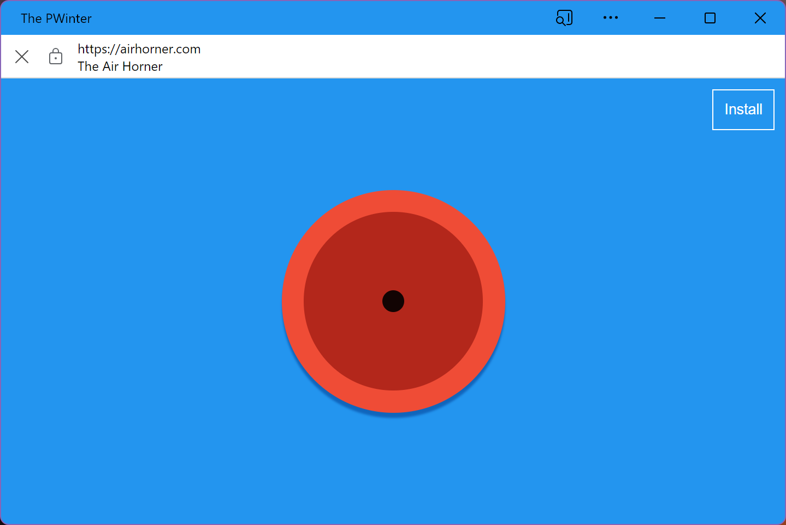
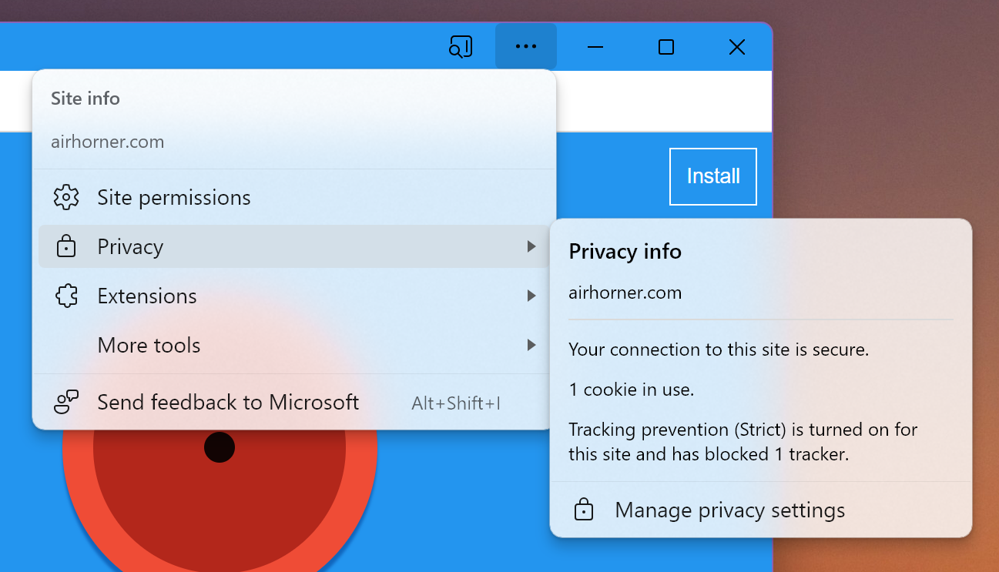

# Scope Extensions for Web Apps

## Overview

This document describes a new `scope_extensions` manifest member that enables
web apps to extend their
[scope](https://www.w3.org/TR/appmanifest/#understanding-scope) to other
origins.

## Introduction

A web application's content might originate from different scopes. Currently, if an installed web application navigates to a url that is out of the scope defined in the manifest file, a security UX will appear in the form of a bar to indicate to the user that they are outside of the defined scope of the application. See figure below. 



The app in he image (`PWinter`) has navigated to a url out of its scope (`airhorner.com`). The white bar on top of the web app is providing information to the user about this change of scope. While this is a security feature, it can be the case that an application would want to extend its scope. For example, an application might host content that is located in one specific origin, and rely on a login page that is out of the scope of the application itself to access that content. In other cases, the same application might be associated to multiple Top Level Domains, that might respond to different geographies (`app.com`, `app.co.uk`, `app.co.cr`, etc).

## Use Cases / Goals

- Allow sites that control multiple subdomains and top level domains to behave
  as one contiguous web app.\
  E.g. a site may span `example.com`, `example.co.uk` and `support.example.com`.

- Allow web apps to capture user navigations to sites they are affiliated with.\
  E.g. "News Aggregator App" capturing links navigations to examplenewssite.com.


## Background

Web app scope (defined by the `scope` field) is currently used for:
1. Determining whether an app window's root document has left the app's scope
   (possibly invoking window UI informing the user of this).
1. Constraining URLs appearing in manifest members like `start_url`, `file_handlers`, or `share_target`.

The `scope_extensions` mechanism can expand all these behaviours to include
other origins given agreement between the web app's primary origin and the
associated origins.


## Proposal

1. Add a `scope_extensions` member to the web app manifest specifying a list of
   origin patterns to associate with.

   Example manifest located at `https://example.com/manifest.webmanifest`:
   ```json
   {
     "id": "/",
     "name": "Example",
     "display": "standalone",
     "start_url": "/index.html",
     "scope_extensions": [
       {"origin": "*.example.com"},
       {"origin": "example.co.uk"},
       {"origin": "*.example.co.uk"},
       {"origin": "*.example.co.uk"}
     ]
   }
   ```
   In this example the "Example" app is extending its app scope to all its
   subdomains along with its `.co.uk` site and its subdomains.

1. Specify a `web-app-origin-association` file format that must be located
   at `https://<associated origin>/.well-known/web-app-origin-association`
   on the associated origin's domain. This specifies a list of web apps that
   may include it as a scope extension.

   Example association file located at
   `https://example.co.uk/.well-known/web-app-origin-association`:
   ```json
   {
     "web_apps": [{
       "web_app_identity": "https://example.com/"
     }, {
       "web_app_identity": "https://associated.site.com/"
     }]
   }
   ```

1. Let the extended scope of a web app be the set of URLs that:
    - Has an origin that matches one of the origin patterns in the manifest's
      `scope_extensions` list.
    - Has an origin with a valid
      `<origin>/.well-known/web-app-origin-association` association file
      with an association entry matching the web app's
      [identity](https://w3c.github.io/manifest/#dfn-identity).

## Security Considerations

### [Launch handling params](https://github.com/WICG/web-app-launch/blob/main/launch_handler.md)

If an URL in extended scope is captured by an app that has 
launch_handler: { client_mode: "focus-existing" } set in its manifest, the URL 
is made visible to the app through Window.launchQueue instead of causing a top 
level navigation. Without scope_extensions, this URL must be from the same 
origin as the app scope. With scope_extensions, this exposed URL can be from a
different origin within extended scope.

### Extended Scope Permissions

When an application uses `scope_extensions` to expand its scope, each additional scope's permissions remain the same. Expanding scopes does not imply any change in permissions. The only thing that changes after being included in a scope is that the security UX will not appear when an app navigates to content served from those scopes.

### Additional security UX

For added security when in the installed web application, the app might display UX that always displays the current scope that is being served, along with privacy and permission settings of that specific scope.



## Future extensions

- More specific scoping e.g. scope suffix or include/exclude lists or
  [URL patterns](https://wicg.github.io/urlpattern/).
  - To be able to apply these more specific scoping rules to the primary
    scope (including exclusion).
    One possible approach is to have the primary origin specified in the
    `scope_extensions` list and have it override the behaviour of `scope`.
- Replace the constraint on manifest URLs that are bound by scope (except for
  `start_url`) to instead be bound by the extended scope. Validation of the
  associated origins is not required for these URLs to be part of a valid
  manifest. Prior to validation the URLs must be treated as if they were not
  specified.

## Related Proposals

### [URL Handlers](https://github.com/WICG/pwa-url-handler/blob/main/explainer.md)

The Scope Extensions proposal is intended to be a replacement for the
[URL Handlers](https://github.com/WICG/pwa-url-handler/blob/main/explainer.md)
proposal with the following changes:
 - Re-orient the goal to be focused just on expanding the set of origins/URLs in
   the web app's scope. Remove the goal of registering web apps as URL handlers
   in the user's operating system. That behaviour will be covered by the
   [Declarative Link Capturing](https://github.com/WICG/sw-launch/blob/main/declarative_link_capturing.md)
   proposal instead.
 - Rename the new manifest field from `url_handlers` to `scope_extensions` to
   reflect the change in goals.
 - Move the association file from "<origin>/web-app-origin-association.json" to
   "<origin>/.well-known/web-app-origin-association". This better conforms
   with [RFC 8615](https://datatracker.ietf.org/doc/html/rfc8615).
 - Change the association file entries to be keyed on the web app identifier
   rather than the web app's manifest URL. This aligns with the recent
   [PWA Unique ID](https://github.com/philloooo/pwa-unique-id/blob/main/explainer.md)
   proposal.
 - Rename `"paths"` to `"include_paths"` in the association file entries.
 - Add an "authorize" field to the association file entries for the associated
   origin to provide explicit opt-in signals for security sensitive
   capabilities.

### [Declarative Link Capturing](https://github.com/WICG/sw-launch/blob/main/declarative_link_capturing.md)

Scope extensions can be considered the first stage in the link capturing
pipeline. This proposal allows developers to control the set of user navigation
URLs that the web app is intended to capture. The
[Declarative Link Capturing](https://github.com/WICG/sw-launch/blob/main/declarative_link_capturing.md)
proposal allows developers to control the action that is taken once a user
navigation is captured e.g. open a new app context or navigate an existing one.
