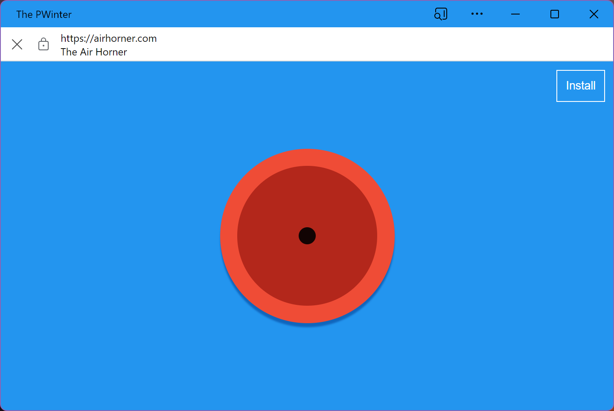

# Scope Extensions for Web Apps

## Overview

This document describes a new `scope_extensions` manifest member that enables
web apps to extend their
[scope](https://www.w3.org/TR/appmanifest/#understanding-scope) to other
origins.

## Introduction

A web application's content might originate from different scopes. Currently, if
an installed web application navigates to a url that is out of the scope defined
in the manifest file, a security UX will appear in the form of a bar to indicate
to the user that they are outside of the defined scope of the application. See
figure below. 



The app in the image (`PWinter`) has navigated to a url out of its scope
(`airhorner.com`). The white bar on top of the web app is providing information
to the user about this change of scope. While this is a security feature, it can
be the case that an application wants to extend its scope. For example, an
application might host content that is located in one specific origin, and rely
on a login page that is out of the scope of the application itself to access
that content. In other cases, the same application might be associated to
multiple Top Level Domains, that might respond to different locales
(`app.com`, `app.co.uk`, `app.co.cr`, etc).


## Use Cases / Goals

- Allow sites that control multiple subdomains and top level domains to behave
  as one contiguous web app.\
  E.g. a site may span `example.com`, `example.co.uk` and `support.example.com`.

- Allow web apps to capture user navigations to sites they are affiliated with.\
  E.g. "News Aggregator App" capturing links navigations to examplenewssite.com.


## Background

Web app scope (defined by the `scope` field) is currently used for:
1. Determining whether an app window's root document has left the app's scope
   (possibly invoking window UI informing the user of this).
1. Constraining URLs appearing in manifest members like `start_url`,
   `file_handlers`, or `share_target`.

The `scope_extensions` mechanism can expand all these behaviours to include
other origins given agreement between the web app's primary origin and the
associated origins.


## Proposal
To extend the app scope, a developer must modify the web app manifest and host
one or more association files.

### Web app manifest
Add a `scope_extensions` member to the web app manifest specifying a list of
origins to include in the extended app scope. 

Example manifest located at `https://example.com/manifest.webmanifest`:
   ```json
   {
     "id": "/",
     "name": "Example App",
     "display": "standalone",
     "start_url": "/app/index.html",
     "scope": "/app",
     "scope_extensions": [
       { "type": "registrable_domain", "value": "https://example.com" },
       { "type": "registrable_domain", "value": "https://example.co.uk" },
       { "type": "origin", "value": "https://helpcenter.example-help-center.com" }
     ]
   }
   ```
In this example the "Example" app has a regular scope of
`http://example.com/app` and is extending its app scope to the registrable
domains of `https://example.com` and `https://example.co.uk`, as well as the
single origin `https://helpcenter.example-help-center.com`. 

Each object in `scope_extension` must contain both `type` and `value` string
fields. The value of `type` must be one of `["origin" | "registrable_domain"]`.
The `value` field must contain a valid URL. 

| type   | Behavior |
|--------|----------|
| `origin` | The URL in `value` is converted to an [origin](https://html.spec.whatwg.org/multipage/browsers.html#concept-origin-tuple). The `/` path of that origin is added to the extended scope.|
| `registrable_domain` | The URL in `value` is converted to a [registrable domain](https://url.spec.whatwg.org/#host-registrable-domain). The `/` paths of all sub-domain origins within the registrable domain are added to the extended scope.|

This format allows for both backward and forward compatibility. For example, a
new type of entry could filter the paths of an origin added to the extended
scope. Entries with types are that not recognized by a user agent should be
ignored.

### Association file
 Specify a `web-app-origin-association` file that must be located at
 `https://<associated origin>/.well-known/web-app-origin-association` on the
 associated origin's domain. This specifies a list of web apps that may include
 it as a scope extension.

   Example association file located at
   `https://example.co.uk/.well-known/web-app-origin-association`:
   ```json
   {
     "web_apps": [{
       "web_app_identity": "https://example.com/"
     }, {
       "web_app_identity": "https://associated.site.com/"
     }]
   }
   ```

The `web_app_identity` field must contain a valid [web application
id](https://w3c.github.io/manifest/#id-member).

### Resulting extended scope
A URL is in the extended scope of a web app if both:
  - It matches an entry in the `scope_extensions` list.
  - That entry has been validated by fetching the
    `<origin>/.well-known/web-app-origin-association` association file with an
    entry matching the app's
    [identity](https://w3c.github.io/manifest/#id-member).

## Security Considerations

### Link capturing from another origin

If an origin A adds a web app B to its `web-app-origin-association` file, A is
implicitly authorizing app B to intercept navigations to URLs in A. This implies
that app B can potentially spoof origin A and therefore it is advised that
origin A and web app B should be owned by the same entity.

User agents may perform link capturing for user navigations within a web app's
extended scope and launch the web app instead of performing the navigation.

The [launch handler][launch-handler] proposal enables sites to reroute app
launches into existing web app contexts.

The combination of link capturing, launch handler and scope extensions leads to
the following attack vector:
1. User installs the TestApp web app from app.com.
1. TestApp's scope includes site.com with valid origin associations.
1. TestApp sets its `launch_handler` to
   ```
   {
     "client_mode": "focus-existing"
   }
   ```
1. User clicks on a link to site.com.
1. Navigation is captured by an existing TestApp window that is brought into
   focus and has a LaunchParam is enqueued.
1. *TestApp is now aware that the user is navigating to site.com and could
   perform a fake navigation with the intention of duping the user into thinking
   they're on site.com.*

## Future extensions

- More specific scoping e.g. scope suffix or include/exclude lists or [URL
  patterns](https://wicg.github.io/urlpattern/).
  - To be able to apply these more specific scoping rules to the primary scope
    (including exclusion). One possible approach is to have the primary origin
    specified in the `scope_extensions` list and have it override the behaviour
    of `scope`.
- Replace the constraint on manifest URLs that are bound by scope (except for
  `start_url`) to instead be bound by the extended scope. Validation of the
  associated origins is not required for these URLs to be part of a valid
  manifest. Prior to validation the URLs must be treated as if they were not
  specified.
- Add an `"authorize"` field to `web-app-origin-association` e.g.:
  ```json
  {
    "web_apps": [{
      "web_app_identity": "https://example.org",
      "authorize": ["intercept-links"]
    }]
  }
  ```
  This opt-in serves as a signal of trust from the associated origin to allow
  the web app to [capture navigations][link-capturing-from-another-origin] into
  the associated origin.

### Extended Scope Permissions

When an application uses `scope_extensions` to expand its scope, **each
additional scope's permissions remain the same**. Expanding scopes does not
imply any change in permissions. The only thing that changes after being
included in a scope is that the security UX will not appear when an app
navigates to content served from those scopes.

### Additional security UX

For added security when in the installed web application, the app might display
UX that always displays the current scope that is being served, along with
privacy and permission settings of that specific scope.


In the previous image, a user can always see which domain is serving content
under the privacy menu. 


## Related Proposals

### [URL Handlers][url-handlers]

The Scope Extensions proposal is intended to be a replacement for the [URL
Handlers][url-handlers] proposal with the following changes:
 - Re-orient the goal to be focused just on expanding the set of origins/URLs in
   the web app's scope. Remove the goal of registering web apps as URL handlers
   in the user's operating system. That behaviour will be covered by individual
   browsers optionally offering users the choice to capture link navigations as
   web app launches.
 - Rename the new manifest field from `url_handlers` to `scope_extensions` to
   reflect the change in goals.
 - Move the association file from "<origin>/web-app-origin-association.json" to
   "<origin>/.well-known/web-app-origin-association". This better conforms with
   [RFC 8615](https://datatracker.ietf.org/doc/html/rfc8615).
 - Change the association file entries to be keyed on the [web app
   identifier](manifest-identity) rather than the web app's manifest URL (the
   former having been added to the Manifest spec in the interim).
 - Rename `"paths"` to `"include_paths"` in the association file entries.
 - Add an "authorize" field to the association file entries for the associated
   origin to provide explicit opt-in signals for security sensitive
   capabilities.


[launch-handler]: https://github.com/WICG/sw-launch/blob/main/launch_handler.md
[url-handlers]: https://github.com/WICG/pwa-url-handler/blob/main/explainer.md
[manifest-identity]: https://w3c.github.io/manifest/#dfn-identity
